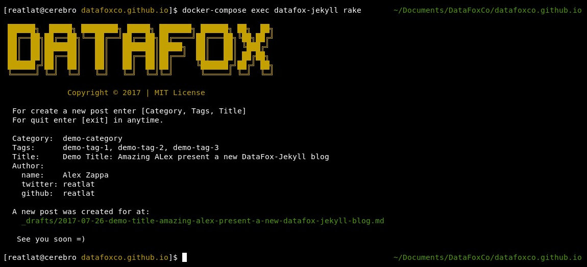

This is the DataFox engineering blog, hosted on github pages.

To create and edit blog posts:

## Initial Setup

- git clone this repo locally

for run project locally, you can use a two way *docker* or *bundler*
- docker
    - install [docker](#docker-setup)
    - install [docker-compose](#docker-setup)
- bundler
    - [install jekyll](https://help.github.com/articles/setting-up-your-github-pages-site-locally-with-jekyll/)
    - `bundle install` to install dependencies


### Running locally:

#### Docker way
```
cd ~/datafoxco.github.io
docker-compose up
```
Visit [localhost](http://localhost) in your browser.

#### Manualy
```
cd ~/datafoxco.github.io
jekyll serve --drafts
```

Visit [localhost:4000](http://localhost:4000) in your browser.

## Writing Posts

#### Using Rake
run Rake task manager with default task(init new post)
```
cd ~/datafoxco.github.io
rake
```
Follow instrunction... Rake will ask you "title", "category", "tags". etc.


[NOTE] Rake automaticly generate UUID, current date, and all meta data which you need for start blogging new post.

#### Docker way
open terminal and wakeup docker container
```
cd ~/datafoxco.github.io
docker-compose up
```
run Rake task manager with default task(init new post)
```
cd ~/datafoxco.github.io
docker-compose exec datafox-jekyll rake
```

#### Manualy
Create a new `.md` file in the `_drafts` folder and edit in markdown.

At the top add a section

    ---
    layout:       post
    uuid:         c12e0920-53ac-0135-99a9-0242ac1f0002
    categories:   demo
    tags:         [demo1, demo2, demo3, demo4]
    title:        'Demo article for example'
    date:         2017-07-25
    author:       
      name:       Alex Zappa
      twitter:    reatlat
      github:     reatlat
    feature_img:  null
    sitemap:
      lastmod:    2017-07-25T16:18:40
      priority:   0.5
      changefreq: monthly
      exclude:    'no'
    ---

Make sure to generate a new UUID for each new page (use v4 if you're wondering). The `uuid` field is necessary to provide a unique ID to each post for our Disqus threads.

Add any images to the `/assets/posts/img` directory and reference like this in your post:

    

You can preview your post by visiting [localhost:4000](http://localhost:4000) in your browser.


## Submitting for Review

Commit your new file in the `_drafts` folder and push to the repo or Phabricator (`arc diff`) for others to see.


## Publishing

Use `git mv` to move your draft file to the `_posts` folder and put the publish date at the beginning like `2017-01-01-my-post.md`.

Commit your change and push to the repo, and it will be automatically built and live within 5 minutes (usually faster).


## Docker Setup

First, get docker, and install:
* [Mac instructions](https://docs.docker.com/docker-for-mac/), [Package](https://download.docker.com/mac/stable/Docker.dmg)
* Linux: [Ubuntu](https://docs.docker.com/engine/installation/linux/ubuntu/)

Once installed, you can check everything is up and running:
```
docker --version
docker-compose --version
docker-machine --version (Mac-only)
```
#### Linux only
On Linux, to manage docker as non-root user, add your user to ```docker``` group:
```
sudo usermod -aG docker $USER
```
and load on startup:
```
sudo systemctl enable docker
```
And if you are using NetworkManager, add a DNS for Docker and restart:
```
echo 'json { "dns": ["8.8.8.8", "8.8.4.4"] }' | sudo tee /etc/docker/daemon.json
sudo service docker restart
```